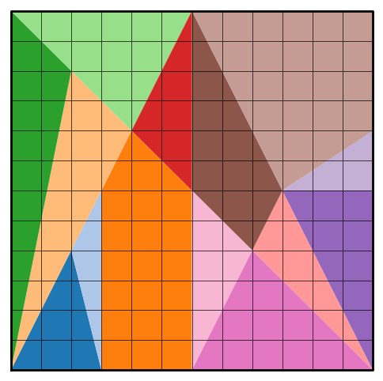

# Ostomachion

## Introduction

…

[https://www.mat.uc.pt/~jaimecs/matelem/stomachion](https://www.mat.uc.pt/~jaimecs/matelem/stomachion)

# Ostomachion algorithm

Our ultimate goal is to find every single way to arrange the polygons inside the frame. To get there, we first need to understand how to sequentially add polygons in such a way that valid solutions are obtained and that no valid solution is unreachable. In this section, we will come up with a set of rules that will help build an algorithm for this purpose.

## Observation #1 - polygons can’t just be placed anywhere

Placing a polygon in some random location might easily give rise to an impossible state. For example, placing a triangle like this makes it impossible to add anything else in the bottom, making a solution with this triangle in place impossible.

To understand where we can actually place them, let’s look at the solution shown above. We notice that in a valid solution

- Every polygon shares every edge with some other polygon or the frame
- No vertex is alone. Every vertex is shared with another polygon or the frame

This can be ensured by placing one polygon at a time, making sure it always shares a vertex and an edge with some other polygon or the frame. That’s our first rule

## Rule #1 - each newly placed polygon must share an edge and a vertex with some other polygon

So, each time that we want to add a new polygon, we choose one of the unused polygons from the polygon pool, select one of its vertices (call it a probing vertex) and move it into place by translating and rotating it until it lies on one of the edges

In the next step, we now have more vertices to choose from where it can be placed. It can either be placed in one of the vertices of the frame or the previously placed polygon. This step is repeated until no more polygons can be added. It may happen that the specific choice of polygon positions is not valid: at some point we will reach a situation where anywhere we try to add a new polygon, it will overlap with some other polygon. To find all possible solutions to the Ostomachion, we just need to repeat these steps with every possible combination of polygons, and see which ones produce actually valid configurations. Concretely, we start with the empty frame, list out all ways to introduce one polygon to it satisfying rule #1, and then repeat this recursively for every new configuration produced. This generates a configuration space that needs to be traversed with some graph search algorithm. Here is an example of a (very) few branches of that graph:

In reality, each of the nodes in the graph gives rise to a much larger number of children nodes (500 children is possible), considering we have to take into account every single possible polygon that fits in every vertex and every possible way to put it there. Note that this graph is an acyclic directed graph. There are several ways to get to the same configuration. In principle, this is enough to find us every possible solution to the Ostomachion puzzle. 

Or is it? (VSauce)

## Observation #2: this will take a while…

A quick estimate shows that this is an impossibly complex combinatorial problem. It’s simply not feasible to ask a computer to solve this. In the first iteration, there’s 4 vertices to choose from, 14 polygons (11 with 3 vertices, 2 with 4 vertices and one with 5), which can be flipped for a total of 368 possibilities. The actual number will be slightly smaller because some of these will be outside of the frame. In the second iteration, the number of vertices to choose from has become larger. It can range from 5 to 7. To get a quick estimate out of this, let’s assume that every polygon has 3 vertices and there’s always 4 vertices to choose from. Then, the number of configurations that need to be analyzed is `(3*4*2)^14*14!` which is around `2*10^30`. This estimate falls short of the actual number because there’s polygons with more vertices and after a few polygons have been placed, the number of vertices to choose from is much larger than 4. But we also need to keep in mind that a large portion of these configurations will be noticeably impossible from an early stage, so that branch doesn’t need to be explored, meaning that the estimate might actually be too large. Regardless, this is an astronomically large number.

We need to narrow down the search space. With the current approach, to make sure that every solution is reached, we could try out every possible probing vertex of every available polygon on every anchor vertex.  In reality, however, if we focus on just one of the vertices, any possible solution that contains this current configuration of polygons will have to have that vertex completely filled, so we just need to consider **one** vertex and **all** the combinations of polygons that fit in there. But we can still do better. Given that all combinations of polygons that fit in this vertex will have some polygon on the right edge, **we just need to try out all polygons that fit on the vertex and lie on that edge**, and then delegate the remaining search to the next recursive step. This massively reduces the search space by getting rid of the `4^14` and brings down the number of configurations to `7*10^21` . If every person on Earth had a computer that could check one configuration every microsecond, we would be done in 10 days. Not too bad. Fortunately, there are plenty of optimizations we can do to get this to run much faster, which will be discussed later.

One question remains: can we choose just any anchor vertex for this purpose? Unfortunately, no. And the reason for this is as subtle as the letter “b” in “subtle”. If we allow anchor vertices to have opening angles >180º, we run the risk of missing out on solutions that use that vertex as part of an edge.

## Rule #2 To obtain all possible solutions containing the current configuration, we only need to consider one vertex, so long as its internal angle is <180º

The only thing left to decide is: which vertex do we choose? For the purpose of solving the problem, it doesn’t matter, but this choice will have important consequences when we decide on the data structures we want to use to traverse the search space. 

To recap, this is the algorithm we will follow. Given some configuration,

- Choose any vertex whose internal angle is <180 and set it as the anchor point and its right edge as the anchor edge.
- Select a polygon from the list of polygons which have not been used yet, and choose a probing vertex from that polygon. Also choose whether to flip the polygon or not.
- If the probing vertex fits in the anchor vertex, bring the polygon here and rotate it to lie on the anchor edge. Make sure it doesn’t intersect anything. This is now a new valid configuration.
- Do the same for all the vertices of this polygon, and then for all the polygons in the list of remaining polygons.
- This will give rise to a new set of valid configurations. Repeat the whole process for each of these configurations.

Starting from a configuration with only a frame and no polygons, this algorithm will produce only valid configurations while not missing out on any valid solution. In the next sections, we will see how to represent this algorithm geometrically, and we will find out how a special set of numbers fits perfectly in this use case - the algebraic numbers.

# Geometric representation

In the previous post, we figured out the algorithm to solve the Ostomachion. Now we need to start thinking ahead and decide how to represent the polygon configuration efficiently. 

A valid configuration consists of a frame and a set of polygons sharing edges and vertices. Some vertices will be full - no further polygons can be added there. We need to make sure that the next polygon we’re adding also gives rise to a valid configuration - it cannot intersect either the frame or any of the existing polygons. While thinking about this, I thought of a couple ways to proceed

## Solution 1: keep a list of used polygons and their positions

This is the simplest approach. We just keep track of the positions of every polygon already placed, and each time that we want to add a new polygon, we just need to check if it overlaps any of the existing ones. If all the polygons involved are convex, this is pretty easy to do: we just need to check if any of the edges contains the other polygon completely on the outside. If they’re not, we can divide each non-convex polygon into a disjoint set of convex polygons, such that each check is simpler. If there are a lot of non-convex polygons, this quickly becomes another combinatorial nightmare. 

Alternatively, it’s possible to check if two polygons overlap by introducing additional checks. To be completely thorough, a lot of checks need to be done (and we’ll discuss these at length in a later post), but realistically, most of the times that two polygons overlap, some edges will intersect. There are edge cases where this is not enough, and that’s why we require additional verifications, but these happen seldom enough that this general approach is still efficient enough.

The downsides of this solution is that the more polygons exist in the configuration, the more checks need to be made, so the algorithm becomes slower precisely in sections of the search tree where there’s a lot of configurations. It also requires storing the locations of every vertex - adding memory transfer overhead when creating new configurations. It also has redundancy, because the same edge may be part of two different polygon, and it will be checked twice.

## Solution 2: same as above, but add bounding boxes

Taking inspiration from game design, adding a bounding box to each polygon reduces the amount of overlaps to check. A check for polygon overlap won’t even happen if the bounding boxes don’t overlap - and it’s very easy to check this. Additionally, organizing the polygons in a quad-tree can even reduce the amount of bounding box overlap checks. But each of these additional layers of optimization require additional data to be stored/transferred and more complicated logic and indirection. I highly doubt this is optimal when the objects we want to check are mostly triangles and when AVX vectorization can make checking intersections blazingly fast. I classify this solution as overengineering.

## Solution 3: merge and prune

In the first iteration, a polygon is added to the frame, sharing one of the edges. This new configuration of frame + polygon can itself be considered a frame for the next iteration. It just requires a little bit of pruning to make sure that no useless edges and vertices get left behind, that is vertices and edges already completely surrounded by polygons. The resulting frame may be a non-convex polygon with many edges, but now we just need to keep track of the frame and which polygons haven’t been added yet - no need to store additional spatial information. Combined with the fact that most overlaps are determined by edge intersections makes this a good candidate for the most efficient solution.  

Merging and pruning removes redundancy and has a small memory footprint, but most importantly, it seemed like a fun thing to implement. So this was my method of choice. This is how it works:

## Merge

Since we want to merge shapes together, assigning an orientation will make the process easier. Let’s consider the frame to have its edges oriented in a clockwise fashion and all the polygons that we want to insert to be oriented anti-clockwise. Then, when the polygon anchors on to the frame and lies on one of the edges, the resulting shape can still be interpreted as a clockwise-oriented frame. Further, let’s define the “outside” portion of a polygon to always lie to the right of its oriented edge. So in the case of the frame, this definition of outside corresponds to the region where we want to place the puzzle polygons. This allows us to claim that a polygon can be added if it does not overlap with the frame, i.e. their inside regions do not overlap. This idea will become useful later.

## Prune

After merging, some of the edges will be overlapping, representing paths going back and forth which can be simplified. Some adjacent vertices might also be overlapping, in which case one of them gets removed. This process is repeated until the frame cannot be simplified further. At its limit, it will simplify down to the empty set when a solution has been found.

The resulting frame polygon is in general non-convex, so we need to come up with an algorithm that is able to detect when two general polygons overlap. This is the subject of the next section.

# When is the polygon entirely inside the frame?

This verification is at the core of solving the Ostomachion puzzle. We need to reliably be able to tell when a configuration of polygons is valid or not, which requires knowing when a polygon candidate will be entirely contained inside the frame.

The most obvious sign that the polygon is not inside the frame is when any of their its edges intersects with those of the frame. It means that some portion of it is inside and another is outside the frame, so it cannot be entirely contained in the frame. If no intersection occurs, we still need to check whether it is inside the frame or not. This is easily done with the ray tracing algorithm. The red polygons are invalid, the blue ones are valid.

These two situations cover most of the common polygon overlaps, that is, the ones that don’t involve any coincidences. When vertices coincide with other vertices or edges, things start getting interesting. Let’s analyze some cases where neither of the previous approaches could detect overlap.

## Edge-vertex coincidence

The figure on the left shows cases where polygon edges intersect with frame vertices and polygon vertices intersect frame edges. The figure on the right shows cases where polygon vertices intersect with frame edges but those create a coincident edge.

Grabbing the frame and stretching it out into a straight line, what’s actually going on becomes clearer after drawing out all the arrows and focusing only on the vertices. The polygon and frame overlap whenever any vertex opens outwards or crosses the frame. If every vertex opens inwards, then the polygon and frame don’t overlap.

Keeping in mind that the frame can also intersect the puzzle polygons’ edges, this verification needs to be done for both the puzzle polygon and the frame.

## Vertex-vertex coincidence

The last remaining case happens even less frequently: when vertices coincide. The next figure shows several examples that would not be captured by any of the previous approaches.

Overlaps happen when the angle swept by the puzzle polygon overlaps with the angle swept by the corresponding vertex of the frame.

# Numerical representation

To tackle computational geometry problems, one usually uses a floating point representation of the positions, which is fast and efficient, but it is an approximation. This approximation is so good that most of the time you won’t even notice it is approximate (more on this later…). However, I became curious