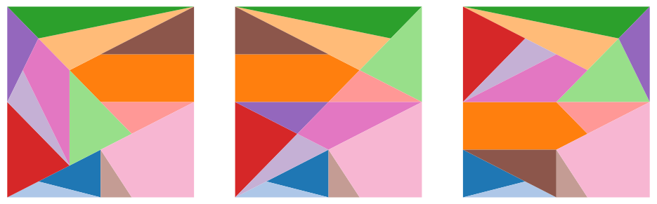

# Ostomachion

Title: Ostomachion

Subtitle: From mathematical exactness to high-performance computing

Tags: HPC

# Introduction - the World's oldest puzzle
The Ostomachion is a puzzle as old as ancient Greece, having fascinated philosophers, mathematicians and the curious minds in general for millennia. It's an especially interesting puzzle to think about when you're bored in conferences (speaking from experience). It's deceivingly simple: given a square tiled with several different shapes, how many ways are there to rearrange the shapes such that they all still fit in the square? The particular selection of shapes that fascinated Aristotle was called Ostomachion, and it looked like this:


Moving these shapes around, we can find a few more solutions to this puzzle





Figuring out how many distinct configurations of shapes exist took two millennia and the advent of modern combinatorics and computing. The answer is 17152. Or 536, if you don't count symmetries as distinct solutions.

In this series of blog posts, I will explain how I approached this problem from a computational perspective. This turned out to be a half-year endeavour, but a very rich and fruitful journey, and it all started when my girlfriend showed me a page on a book. It led me through the design of a special numerical system and subsequent approximations in the sake of computational efficiency. It led me through group theory, data structures, modern C++ and high-performance-oriented design. With these blog posts, I hope to share my enthusiasm for all the things I learned, and hopefully challenge someone to come up with a more efficient solution! 


## References:
- Wikipedia page: https://en.wikipedia.org/wiki/Ostomachion
- List of solutions: https://pi.math.cornell.edu/~mec/GeometricDissections/1.2%20Archimedes%20Stomachion.html
- Non-square solutions: http://www.logelium.de/Stomachion/StomachionPuzzel_EN.htm


# Ostomachion algorithm

Our ultimate goal is to find every single way to arrange the polygons inside the frame. To get there, we first need to understand how to sequentially add polygons in such a way that only valid solutions are obtained and that no valid solution is unreachable. In this section, we will come up with a set of rules that will help build an algorithm for this purpose.

## Observation #1 - polygons can’t just be placed anywhere

Placing a polygon in some random location might easily give rise to an impossible state. For example, placing a triangle like this makes it impossible to add anything else in the bottom, making a solution with this triangle in place impossible.


To understand where we can actually place them, let’s look at the solution shown above. We notice that in virtue of tiling the square, in a valid solution

- every polygon shares every edge with some other polygon or the frame
- no vertex is alone. Every vertex is shared with another polygon or the frame

This can be ensured by placing one polygon at a time, making sure it always shares a vertex and an edge with some other polygon or the frame. That’s our first rule

## Rule #1 - each newly placed polygon must share an edge and a vertex with some other polygon

So, each time that we want to add a new polygon, we choose one of the unused polygons from the polygon pool, select one of its vertices (call it a probing vertex) and move it into place by translating and rotating it until it lies on one of the edges


In the next step, we now have more vertices to choose from where it can be placed. It can either be placed in one of the vertices of the frame or the previously placed polygon. This step is repeated until no more polygons can be added. It may happen that the specific choice of polygon positions is not valid: at some point we will reach a situation where anywhere we try to add a new polygon, it will overlap with some other polygon. To find all possible solutions to the Ostomachion, we just need to repeat these steps with every possible combination of polygons, and see which ones produce actually valid configurations. Concretely, we start with the empty frame, list out all ways to introduce one polygon to it satisfying rule #1, and then repeat this recursively for every new configuration produced. This generates a configuration space that needs to be traversed with some graph search algorithm. Here is an example of a (very) few branches of that graph:


In reality, each of the nodes in the graph gives rise to a much larger number of children nodes (500 children is possible), considering we have to take into account every single possible polygon that fits in every vertex and every possible way to put it there. Note that this graph is an acyclic directed graph. There are several ways to get to the same configuration. In principle, this is enough to find us every possible solution to the Ostomachion puzzle. 

Or is it? (VSauce)

## Observation #2: this will take a while…

A quick estimate shows that this is an impossibly complex combinatorial problem. It’s simply not feasible to ask a computer to solve this. In the first iteration, there’s 4 vertices to choose from, 14 polygons (11 with 3 vertices, 2 with 4 vertices and one with 5), which can be flipped for a total of 368 possibilities. The actual number will be slightly smaller because some of these will be outside of the frame. In the second iteration, the number of vertices to choose from has become larger. It can range from 5 to 7. To get a quick estimate out of this, let’s assume that every polygon has 3 vertices and there’s always 4 vertices to choose from. Then, the number of configurations that need to be analyzed is `(3*4*2)^14*14!` which is around `2*10^30`. This estimate falls short of the actual number because there’s polygons with more vertices and after a few polygons have been placed, the number of vertices to choose from is much larger than 4. But we also need to keep in mind that a large portion of these configurations will be noticeably impossible from an early stage, so that branch doesn’t need to be explored, meaning that the estimate might actually be too large. Regardless, this is an astronomically large number.

We need to narrow down the search space. With the current approach, to make sure that every solution is reached, we could try out every possible probing vertex of every available polygon on every anchor vertex.  In reality, however, if we focus on just one of the vertices, any possible solution that contains this current configuration of polygons will have to have that vertex completely filled, so we just need to consider **one** vertex and **all** the combinations of polygons that fit in there. But we can still do better. Given that all combinations of polygons that fit in this vertex will have some polygon on the right edge, **we just need to try out all polygons that fit on the vertex and lie on that edge**, and then delegate the remaining search to the next recursive step. This massively reduces the search space by getting rid of the `4^14` and brings down the number of configurations to `7*10^21` . If every person on Earth had a computer that could check one configuration every microsecond, we would be done in 10 days. Not too bad. Fortunately, there are plenty of optimizations we can do to get this to run much faster, which will be discussed later.

One question remains: can we choose just any anchor vertex for this purpose? Unfortunately, no. And the reason for this is as subtle as the letter “b” in “subtle”. If we allow anchor vertices to have opening angles >180º, we run the risk of missing out on solutions that use that vertex as part of an edge.


## Rule #2 To obtain all possible solutions containing the current configuration, we only need to consider one vertex, so long as its internal angle is <180º

The only thing left to decide is: which vertex do we choose? For the purpose of solving the problem, it doesn’t matter, but this choice will have important consequences when we decide on the data structures we want to use to traverse the search space. 

To recap, this is the algorithm we will follow. Given some configuration,

- Choose any vertex whose internal angle is <180 and set it as the anchor point and its right edge as the anchor edge.
- Select a polygon from the list of polygons which have not been used yet, and choose a probing vertex from that polygon. Also choose whether to flip the polygon or not.
- If the probing vertex fits in the anchor vertex, bring the polygon here and rotate it to lie on the anchor edge. Make sure it doesn’t intersect anything. This is now a new valid configuration.
- Do the same for all the vertices of this polygon, and then for all the polygons in the list of remaining polygons.
- This will give rise to a new set of valid configurations. Repeat the whole process for each of these configurations.

Starting from a configuration with only a frame and no polygons, this algorithm will produce only valid configurations while not missing out on any valid solution. In the next sections, we will see how to represent this algorithm geometrically, and we will find out how a special set of numbers fits perfectly in this use case - the algebraic numbers.

# Geometric representation

In the previous post, we figured out the algorithm to solve the Ostomachion. Now we need to start thinking ahead and decide how to represent the polygon configuration efficiently. 

A valid configuration consists of a frame and a set of polygons sharing edges and vertices. Some vertices will be full - no further polygons can be added there. We need to make sure that the next polygon we’re adding also gives rise to a valid configuration - it cannot intersect either the frame or any of the existing polygons. While thinking about this, I thought of a couple ways to proceed

## Solution 1: keep a list of used polygons and their positions

This is the simplest approach. We just keep track of the positions of every polygon already placed, and each time that we want to add a new polygon, we just need to check if it overlaps any of the existing ones. If all the polygons involved are convex, this is pretty easy to do: we just need to check if any of the edges contains the other polygon completely on the outside. If they’re not, we can divide each non-convex polygon into a disjoint set of convex polygons, such that each check is simpler. If there are a lot of non-convex polygons, this quickly becomes another combinatorial nightmare. 

Alternatively, it’s possible to check if two polygons overlap by introducing additional checks. To be completely thorough, a lot of checks need to be done (and we’ll discuss these at length in a later post), but realistically, most of the times that two polygons overlap, some edges will intersect. There are edge cases where this is not enough, and that’s why we require additional verifications, but these happen seldom enough that this general approach is still efficient enough.

The downsides of this solution is that the more polygons exist in the configuration, the more checks need to be made, so the algorithm becomes slower precisely in sections of the search tree where there’s a lot of configurations. It also requires storing the locations of every vertex - adding memory transfer overhead when creating new configurations. It also has redundancy, because the same edge may be part of two different polygon, and it will be checked twice.

## Solution 2: same as above, but add bounding boxes

Taking inspiration from game design, adding a bounding box to each polygon reduces the amount of overlaps to check. A check for polygon overlap won’t even happen if the bounding boxes don’t overlap - and it’s very easy to check this. Additionally, organizing the polygons in a quad-tree can even reduce the amount of bounding box overlap checks. But each of these additional layers of optimization require additional data to be stored/transferred and more complicated logic and indirection. I highly doubt this is optimal when the objects we want to check are mostly triangles and when AVX vectorization can make checking intersections blazingly fast. I classify this solution as overengineering.

## Solution 3: merge and prune

In the first iteration, a polygon is added to the frame, sharing one of the edges. This new configuration of frame + polygon can itself be considered a frame for the next iteration. It just requires a little bit of pruning to make sure that no useless edges and vertices get left behind, that is vertices and edges already completely surrounded by polygons. The resulting frame may be a non-convex polygon with many edges, but now we just need to keep track of the frame and which polygons haven’t been added yet - no need to store additional spatial information. Combined with the fact that most overlaps are determined by edge intersections makes this a good candidate for the most efficient solution.  

Merging and pruning removes redundancy and has a small memory footprint, but most importantly, it seemed like a fun thing to implement. So this was my method of choice. This is how it works:

## Merge

Since we want to merge shapes together, assigning an orientation will make the process easier. Let’s consider the frame to have its edges oriented in a clockwise fashion and all the polygons that we want to insert to be oriented anti-clockwise. Then, when the polygon anchors on to the frame and lies on one of the edges, the resulting shape can still be interpreted as a clockwise-oriented frame. Further, let’s define the “outside” portion of a polygon to always lie to the right of its oriented edge. So in the case of the frame, this definition of outside corresponds to the region where we want to place the puzzle polygons. This allows us to claim that a polygon can be added if it does not overlap with the frame, i.e. their inside regions do not overlap. This idea will become useful later.

## Prune

After merging, some of the edges will be overlapping, representing paths going back and forth which can be simplified. Some adjacent vertices might also be overlapping, in which case one of them gets removed. This process is repeated until the frame cannot be simplified further. At its limit, it will simplify down to the empty set when a solution has been found.


The resulting frame polygon is in general non-convex, so we need to come up with an algorithm that is able to detect when two general polygons overlap. This is the subject of the next section.

# When is the polygon entirely inside the frame?

This verification is at the core of solving the Ostomachion puzzle. We need to reliably be able to tell when a configuration of polygons is valid or not, which requires knowing when a polygon candidate will be entirely contained inside the frame.

The most obvious sign that the polygon is not inside the frame is when any of their its edges intersects with those of the frame. It means that some portion of it is inside and another is outside the frame, so it cannot be entirely contained in the frame. If no intersection occurs, we still need to check whether it is inside the frame or not. This is easily done with the ray tracing algorithm. The red polygons are invalid, the blue ones are valid.


These two situations cover most of the common polygon overlaps, that is, the ones that don’t involve any coincidences. When vertices coincide with other vertices or edges, things start getting interesting. Let’s analyze some cases where neither of the previous approaches could detect overlap.

## Edge-vertex coincidence

The figure on the left shows cases where polygon edges intersect with frame vertices and polygon vertices intersect frame edges. The figure on the right shows cases where polygon vertices intersect with frame edges but those create a coincident edge.


Grabbing the frame and stretching it out into a straight line, what’s actually going on becomes clearer after drawing out all the arrows and focusing only on the vertices. The polygon and frame overlap whenever any vertex opens outwards or crosses the frame. If every vertex opens inwards, then the polygon and frame don’t overlap.


Keeping in mind that the frame can also intersect the puzzle polygons’ edges, this verification needs to be done for both the puzzle polygon and the frame.

## Vertex-vertex coincidence

The last remaining case happens even less frequently: when vertices coincide. The next figure shows several examples that would not be captured by any of the previous approaches.


Overlaps happen when the angle swept by the puzzle polygon overlaps with the angle swept by the corresponding vertex of the frame.


# Mathematical representation

So far, we realized that the Ostomachion can be solved by translating and rotating polygons around. Next, we need to to figure out a way to represent them in code. We could just use a floating-point representation for the angles and coordinates, but I'd like to use this section to explore a different approach: <b>can we do this in a mathematically exact way in code</b>?

There are three main things we need to ensure: 
- <b>angles</b> representing the angle the edges make with the x axis and the opening angle between edges. They need to support angle addition and subtraction
- <b>vectors</b> representing the locations of the polygon's vertices. These need to support vector addition, dot product and rotation by an angle
- we need to be able to <b>compare</b> these vectors and angles to determine polygon overlap

For practical purposes, we only ever need the sine and cosine of the angle, because that's what's required for rotations. Rotation of a vector by an angle then consists of a simple set of products and additions, no need to calculate trigonometric functions. Let's then represent the angle by a unit vector whose coordinates are $\left(\cos, \sin\right)$, or alternatively, as a complex number $z=\cos + i\sin$. Likewise, the vectors are simply represented by their coordinates $\left(x, y\right)$, or alternatively, as the complex number $z=x+i y$. Complex numbers are a really good fit for this problem because they encapsulate the idea of rotation and translation very naturally within their structure:
- Vector addition becomes complex number addition
- Rotation of a vector by an angle becomes complex number multiplication

## Complex algebraic numbers
What type of number should we use for the complex number components? If we want mathematical exactness, floating point numbers are right out. Looking at the Ostomachion puzzle pieces, they have one very important property: all their vertices lie on integer coordinates! Analyzing the angles that the edges make with the $x$ axis, each edge can be seen as the hypotenuse of a right triangle with integer legs, which means that <b>all</b> of the sines and cosines in the image are of the form 

$$\frac{a}{b}\sqrt{c}$$

where $a$, $b$ and $c$ are all integers. This can be used as the basis for our numeric system. 

First, let's notice that this representation can be made unique by requiring that $c$ be expressable as a product of non-repeated primes, that is, the square root cannot be further simplified. Second, suppose we start with a vector of integer coordinates $z=x+iy$ and rotate it by an angle represented by $w=\frac{a}{b}\sqrt{c}+i\frac{d}{e}\sqrt{f}$. Then, the new point will be 
$$z^\prime = zw=\left(x \frac{a}{b}\sqrt{c} - y\frac{d}{e}\sqrt{f}\right) + i\left(y \frac{a}{b}\sqrt{c} + x\frac{d}{e}\sqrt{f}\right)$$

As the vectors get translated and rotated, their components will pick up more and more radicals, and some radicals will combine with others. We can already see that a general representation of a number in this numeric system will be composed of a sum of many fractions multiplied by square roots:

$$ x = \sum_i \frac{a_i}{b_i}\sqrt{c_i}$$

What square roots should be included exactly? To answer this, we need to iterate over all puzzle pieces, compute their sines and cosines and see what is inside the square root after simplification. Surprisingly, only four different square roots appear: $\sqrt{2}$, $\sqrt{5}$, $\sqrt{13}$ and $\sqrt{17}$. This means that $\sqrt{c_i}$ can only assume $2^4$ different values, consisting of all possible combinations of products of these square roots and $\sqrt{1}$. Here are some examples

$$ 1 + \frac{1}{2}\sqrt{2}$$
$$ \frac{4}{3} $$
$$ -\frac{1}{2}\sqrt{5} + 4\sqrt{65} $$
$$ -2 -\frac{3}{7}\sqrt{10} - \frac{1}{10}\sqrt{17} + \frac{9}{5}\sqrt{221} $$

These kinds of numbers are a type of <b>algebraic numbers</b> and are closed under the basic arithmetic operations of addition, subtraction, multiplication and division. They are represented as $\mathbb{Q}[\sqrt{2}, \sqrt{5}, \sqrt{13}, \sqrt{17}]$.

## Comparing algebraic numbers
Being able to compare two numbers is a basic essential operation to determine polygon overlap. We all know how to do it for real and rational numbers, but algebraic numbers pose a challenge because we cannot approximate the square roots. Without loss of generality, let's assume we want to know whether an algebraic number $x > 0$. How do we determine whether that sum evaluates to a positive or a negative number?

To answer this, it helps to begin with a simpler example, the set of algebraic numbers that only contains $\sqrt{2}$, that is numbers $x\in\mathbb{Q}[\sqrt{2}]$ of the form $a+b\sqrt{2}$ where $a,b\in\mathbb{Q}$ are rational numbers. We can determine how $x$ relates to $0$ by doing the following checks:
- $x$ is zero only if both $a$ and $b$ are zero
- if any of $a$ and $b$ are zero, the sign is the same as the non-zero fractional number. 
- if $a$ and $b$ are both positive, then $x$ is positive
- if $a$ and $b$ are both negative, then $x$ is negative
- if $a>0$ and $b<0$, then $(a+b\sqrt{2})(a-b\sqrt{2})$ has the same sign as $x$, but evaluates to the simpler rational expression $a^2 - 2b^2$ which we know how to evaluate
- similarly, if $a<0$ and $b>0$, $x$ has the same sign as $2b^2 - a^2$

So, the trick to finding the sign of this simple algebraic number lies in using its conjugate to convert it into a rational number that we know how to evaluate. Repeating this process recursively will allows us to estimate the sign of an algebraic number with an arbitrary number of radicals. 

Consider now $x\in \mathbb{Q}[\sqrt{2}, \sqrt{5}]$ of the form 

$$x = a + b\sqrt{2} + c\sqrt{5} + d\sqrt{10}$$ 

where $a$, $b$, $c$, $d$ are rational numbers. $x$ can also be expressed as

$$ x = A + B\sqrt{5} $$

where $A = a + b\sqrt{2}$ and $B = c + d\sqrt{2} $ are simpler algebraic numbers that only contain $\sqrt{2}$. To get the sign of $x$, we just need to do the same checks as before on $A$ and $B$, keeping in mind that each of those will also require individual checks because they themselves are algebraic numbers. This establishes a recursive chain that stops when we reach a rational number and is easily generalizeable to the case we are actually interested in.

Now that we know how to deal with algebraic numbers, we can forget about their structure and just keep in mind that we know how to add, multiply and compare them.

## Adding and comparing angles
Angle addition is done via trigonometric rules (or equivalently via complex number multiplication)

$$ \cos(\alpha+\beta) = \cos(\alpha)\cos(\beta) - \sin(\alpha)\sin(\beta) $$ 
$$ \sin(\alpha+\beta) = \cos(\alpha)\sin(\beta) + \sin(\alpha)\cos(\beta) $$

which only requires knowledge of the other angles' sines and cosines. Now, how do we compare angles when all we know is their trigonometric components? We begin by interpeting the components $\cos(\alpha), \sin(\alpha)$ as an angle with the $x$ axis. Then, if both sines are positive, the larger angle is the one with the smaller cosine, and if both sines are negative, the larger angle is the one with the larger cosine. If the sines have different signs, the angle with negative sine is larger.

## Arbitrary precision integers
The only thing missing now is how to deal with the fractions. We could just use integers to represent these fractions and call it a day, but when we get down to actually programming it, we run into a problem: in many programming languages, regular integers just aren't large enough to store all the information we need. This becomes especially noticeable when we try to determine if an algebraic number is positive because of the process of squaring the integers. In our case, this generally needs to be done four times, yielding potentially very large integers that languages such as C++ cannot represent normally. The solution is to use a library that provides arbitrary precision integers, like GMP. Python already does this from the get-go. 

## Summary and shortcomings
In principle, we now have all the mathematical structure required to solve our problem. This is what we learned so far:
1. A complex number structure is a natural way to represent the operations we want to support: translation and rotation. 
2. Algebraic numbers allow us to implement this complex number structure in a way that exactly represents polygons of integer coordinates.
3. Arbitrary precision integers enable the fractions in the algebraic numbers to be represented in code in a mathematically exact way.

In my opinion this is a beautiful and satisfying way to approach the puzzle, and it's why I decided to explore it (and implement it), but it has one significant flaw. It is slow. Painfully slow. It's $200$ times slower than using floating-point numbers, so if we want to solve this puzzle in any decent amount of time we will have to sacrifice some mathematical exactness for speed. In the interest of curiosity, my current implementation of the code supports both floating-point numbers and algebraic numbers via template arguments.

# Digital representation
By now, we have all the ingredients needed to solve the Ostomachion puzzle, so it's time to start thinking about actually coding it. On the one hand, I want to extract as much performance out of the code as I can, so the inner performance-critical parts of the code will make extensive use of templates, raw pointers and data structures which optimize memory transfer. These are things like the arithmetic operations, polygon copy and polygon overlap. On the other hand, I want to make good use of abstraction to make the code easier to read and maintain, so the non-performance-critical sections of the code will use constructs like inheritance, factories and smart pointers. I also want to support several ways to do the same thing, so I can compare the performance. Finally, I want to benchmark the whole thing.

First, we need a data type that codifies the numbers needed for all the operations. We saw in the previous post that we can use algebraic numbers or floating point numbers. Let's call this the `Number` class and require it to support <b>addition</b>, <b>subtraction</b>, <b>multiplication</b> and <b>comparison</b>. In the case of floats, comparison is done up to a tolerance which is defined in compile time.

Second, we define the `Angle` class, which contains the `Number`s cosine and sine, and supports addition and subtraction;
```c++
template <typename Number>
struct Angle {
    Number cos, sin;
    Angle& operator+(const Angle& other_angle);
    Angle& operator-(const Angle& other_angle);
};
```

Third, we need to codify the polygon and its vertices. Because of the Merge and Prune algorithm that we want to use for combining polygons, vertices need to be often updated, added and removed from arbitrary sections of the polygon, so it makes sense to implement the polygon as a circular doubly-linked list of vertices. Let's define the templated `Vertex` class which receives a `Number` as a template argument and supports translation and rotation.

```c++
template <typename Number>
struct Vertex {
    Number x, y; // position of the vertex
    Vertex *next, *previous; // doubly-linked list pointers
    Angle<Number> start, end, opening; // angles
    void translate(const Number& dx, const Number& dy);
    void rotate(const Angle& angle);
};
```
The `Polygon` class contains an overlap method as discussed in a previous post.
```c++
template <typename Number>
struct Polygon {
    Vertex<Number> *head; // head of the circular linked list
    void translate(const Number& dx, const Number& dy);
    void rotate(const Angle& angle);
    bool overlaps(const Polygon& polygon);
};
```
Fourth, we need a container `State` to codify a configuration of polygons and provide a way to find configurations branching out from this one. It needs to contain the following information: the current frame polygon, which polygons are left to insert and the location of currently-inserted polygons (so that the state can be correctly visualized later). I decided to template it with `Polygon` instead of `Number` because at this level of abstraction, we will not need to think about the numbers at all. It contains all the information required to find all the next valid states that branch out from this one, so it also implements a `find_next_states()` method. Additionally, it also implements a `selector` method which selects one `Vertex` (by its index) from the `Polygon` to serve as an anchor vertex, as discussed before.

```c++
template <typename Polygon>
struct State {
    Polygon frame;
    std::vector<Polygon> missing;
    std::vector<Polygon> inserted;
    std::vector<State> find_next_states();
    std::function<unsigned int(Polygon)> selector;
};
```
Fifth, we have to define the puzzle, that is, define the polygons that should be included, and what the initial frame looks like. Additionally, we can also use this step to provide information on the manipulations that we want to allow for each polygon. For example, we might decide that the polygons cannot be flipped, what vertices can be used as probing vertices, etc. Let's codify all of this in a `RestrictedPolygon` class, which contains information about the allowed transformations, the amount of identical polygons and the polygon itself. The `PolySet` class is then a set of `RestrictedPolygon`s and a frame. This class is general enough to let us solve any similar puzzle, not just the Ostomachion!

```c++
template <typename Polygon>
struct RestrictedPolygon {
    Polygon polygon;
    unsigned int amount;
    enum transformations {Flip, Rotate, FlipRotate, None};
};

template <typename Polygon>
struct PolySet {
    std::vector<RestrictedPolygon<Polygon>> polygons;
    Polygon initial_frame;
};
```

Sixth, the puzzle is going to be solved via traversal of a graph, so we need to encode that somehow. As we've seen in a previous post, the graph is in general an acyclic directed graph, since there may be several different ways to reach any state from a previous state. We want to avoid repeating any calculations, so we need to keep track of which nodes (`State`s) have already been computed. Then, we can use a hash table to keep track of the previously-computed nodes and a stack of nodes we want to visit. Each time that a node is visited, if the node wasn't already computed, we run the `find_next_states()` on this node and put the resulting `State`s back on the stack. All of this logic can be done internally and abstracted away in a `Container` class, which only exposes methods to insert and remove a shared pointer to a `State`.
```c++
template <typename State>
struct Container {
    std::unsorted_set<std::shared_ptr<State>> hash_map;
    std::vector<std::shared_ptr<State>> stack;
    std::shared_ptr<State> get();
    void insert(std::shared_ptr<State> state);
};

```
 When a node is inserted, it's checked against the hash table. If it already exists, then this operation does nothing. If it does not exist, it is added to the hash table and the stack. The `get` method returns an element from the stack.

## Solving the puzzle
All of the previous ingredients now come together to solve the puzzle:

1. Initialize the `missing` and `frame` fields in `State` from the Ostomachion `PolySet`.
2. Insert this `State` into a `Container`.
3. Get a `State` from the `Container`, run `find_next_states()` and insert them all back into the `Container`.
4. Repeat step 3 until the `get` operation yields no more states. 
5. Iterate over the hash table in the `Container` and check which `States` have no missing polygons.

This is indeed all we need to do to solve the puzzle, and if your computer had a few petabytes of RAM lying around, it would work. Unfortunately, the search graph is just too large. Keeping a hash table with <b>all</b> the `State`s is just unfeasible, especially considering that only a tiny portion of those are valid final states. The next sections are about optimizing every step of this process as much as possible.

# Algorithmic optimizations
So far, we set the groundwork to solve the puzzle, but despite all the effort, the problem is still unsolvable. Fortunately, with a few more optimizations, we will go from an impossible problem to a possible one.

## Choice of anchor vertex
The main issue with our solution was the fact that we needed to store an enormous amount of states to make sure we didn't repeat calculations. We could try to come up with some clever algorithm to avoid keeping so many states in memory, but the underlying problem is that the search space is a directed acyclic graph (DAG) in virtue of our choice of anchor vertex. This is now a good time to discuss how to choose the anchor vertex. Here are two possibilities:

1. Choosing the frame vertex with the smallest internal angle. This was my original idea, and the rationale for that was that by choosing the smallest internal angle, I'd minimize the amount of polygons that could fit into this vertex and reduce the amount of children nodes. The problem is that the resulting search space becomes a DAG and has to be searched using the procedure discussed before

2. Choose the left-most vertex in the frame. If several vertices have this property, choose the bottom-most one. Every state now has only one way to be produced, turning the search space into a tree! A standard Depth-First Search (DFS) algorithm with a stack can be used to search the whole space, while the number of `State`s in memory never exceeds double digits. In our `Container`, we can get rid of the hash map, and modify the insert method to always add the new State to the end of the vector.

```c++
template <typename State>
struct Container {
    std::vector<std::shared_ptr<State>> stack;
    std::shared_ptr<State> get();
    void insert(std::shared_ptr<State> state);
};

```
The puzzle is finally solvable! We get the correct answer 17152 in 300 hours. ??? But can we do better?

## Symmetry
The puzzle frame is a square, so if we know one solution, then rotating all the polygons of that solution by 90º aroudn the center of the frame produces another solution. Likewise, flipping all the polygons along the horizontal, vertical or diagonal axes also produces a solution: the puzzle has Square Dihedral Symmetry. To make use of this symmetry, we should try to generate only one minimal set of solutions from which all the others can be obtained by symmetry operations. 

Looking at a bunch of solutions, let's focus on just one of the polygons and apply symmetry operations on the solution until this polygon is as close as possible to the bottom-left section of the lower edge. It is always possible to make this polygon lie inside the triangular region. So, working backwards, we can impose that this triangle must always lie inside this region while constructing the solutions. We choose only <b>one</b> of the puzzle polygons and require that it be inside the bottom-left right triangle. A slight modification to `RestrictedPolygon' gives us that functionality:

```c++
template <typename Polygon>
struct RestrictedPolygon {
    Polygon polygon;
    std::optional<Polygon> restriction;
    unsigned int amount;
    enum transformations {Flip, Rotate, FlipRotate, None};
};
```
This brings down the computation time to ...

## Identical polygons
The eagle-eyed reader might notice that some polygons in the puzzle are actually identical, even though they have different colors. This can be exploited to save computation time. If polygons A and B are identical, then when attempting to place every possible polygon in the anchor vertex, we only need to place one of those two polygons, cutting down on the amount of children per node, and reducing the total number of solutions by a factor of two. This is why `RestrictedPolygon` has an `amount` field.

## Ordering PolySet

## Multithreading
Multithreading is an obvious way to reduce computation time


# Memory optimizations

# Vectorization
Compiler wins

# Conclusion