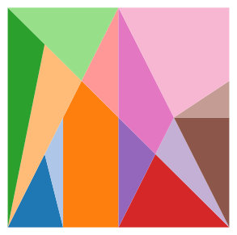

# Ostomachion

Title: Ostomachion

Subtitle: From mathematical exactness to high-performance computing

Tags: HPC

# Introduction - the World's oldest puzzle
The Ostomachion is a puzzle as old as ancient Greece, having fascinated philosophers, mathematicians and the curious minds alike for millennia. It's an especially interesting puzzle to think about when you're bored in conferences (speaking from experience). It's deceivingly simple: given a square tiled with several different shapes, how many ways are there to rearrange the shapes such that they all still fit in the square? The particular selection of shapes that fascinated Aristotle was called Ostomachion, and it looked like this:

<figure style="text-align: center;">
  
  <figcaption><strong>Figure 1.1:</strong> The Ostomachion puzzle.</figcaption>
</figure>

Moving these shapes around, we can find a few more solutions to this puzzle

<figure style="text-align: center;">
  
  <figcaption><strong>Figure 1.2:</strong> Three additional solutions to the puzzle.</figcaption>
</figure>

Figuring out how many distinct configurations of shapes exist took two millennia and the advent of modern combinatorics and computing. The answer is 17152. Or 536, if you don't count symmetries as distinct solutions.

In this series of blog posts, I will explain how I approached this problem from a computational perspective. This turned out to be a half-year endeavour, but a very rich and fruitful journey, and it all started when my girlfriend showed me a page on a book on Mathematics. It led me through the design of a special numerical system and subsequent approximations in the sake of computational efficiency. It led me through group theory, data structures, modern C++ and high-performance-oriented design. With these blog posts, I hope to share my enthusiasm for all the things I learned, and hopefully challenge someone to come up with a more efficient solution! 

## References:
- Wikipedia page: https://en.wikipedia.org/wiki/Ostomachion
- List of solutions: https://pi.math.cornell.edu/~mec/GeometricDissections/1.2%20Archimedes%20Stomachion.html
- Non-square solutions: http://www.logelium.de/Stomachion/StomachionPuzzel_EN.htm

